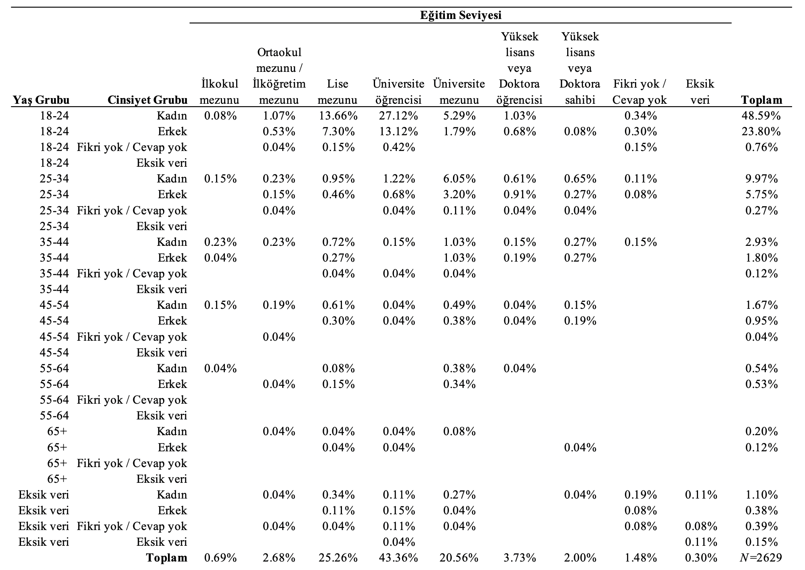
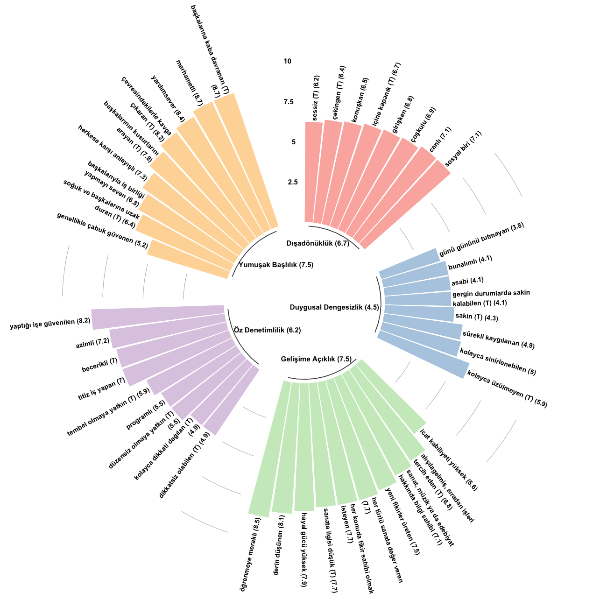
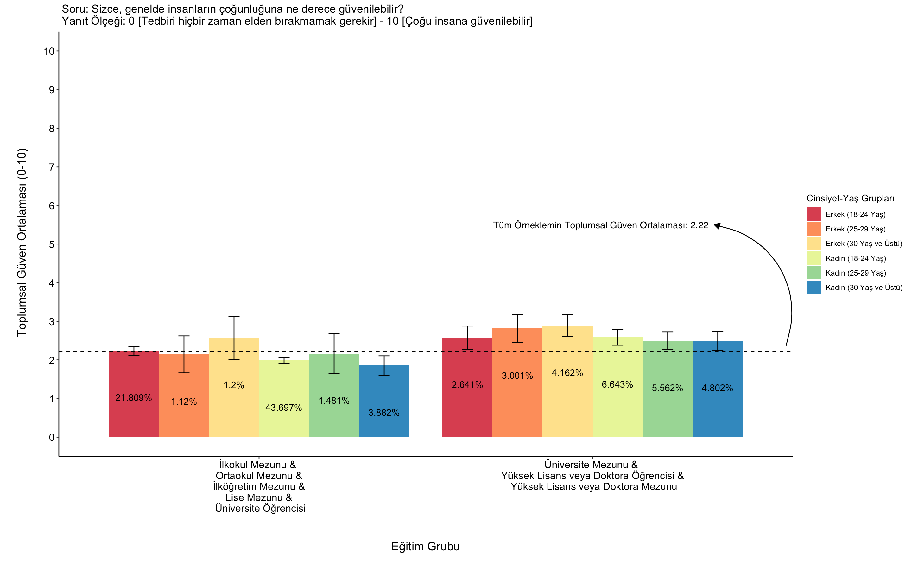
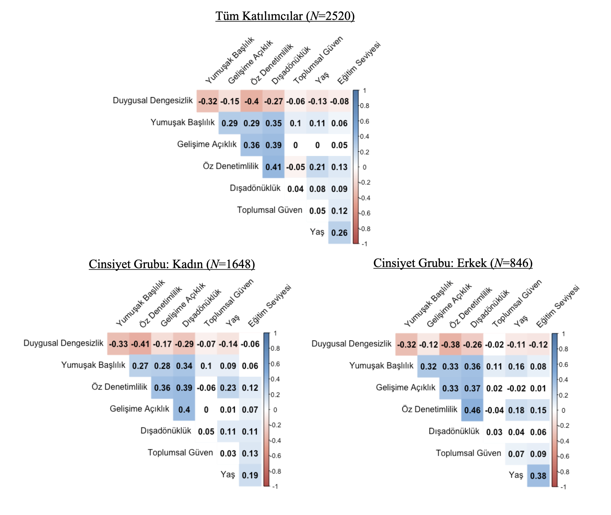

---

<b>ÖNEMLİ:</b> Bu sayfanın nihai amacı seçili değişkenlere dair betimleyici istatistiklerin paylaşılmasıdır. Dolayısıyla, ilgili her bir değişkenin kuramsal ve görgül değerlendirmesi ve testi burada yapılmayacaktır. Daha fazla bilgi için lütfen araştırma asistanı Fatih Erol (e-posta: ferol15@ku.edu.tr) ile iletişime geçiniz.

<b>Temsili olmayan</b>  ilk internet anketi çalışmamız 15-23 Haziran 2018 tarihleri aralığında gerçekleştirilmiştir. Araştırmamıza toplamda 18 yaş ve üstünde 2629 kişi katılmıştır. Katılımcıların yaş, cinsiyet ve eğitim gruplarına göre göstermiş oldukları dağılım Şekil 1’deki gibidir.

 

0 (Tamamen yanlış) – 10 (Tamamen doğru) ölçeğinde <i>Beş Büyük Kişilik Özellikleri</i> (44 Kalemlik) envanterini yanıtlayan katılımcıların ortalama <i>Gelişime Açıklık</i> düzeyi 7.5, <i>Öz Denetimlilik</i> düzeyi 6.2, <i>Dışadönüklük</i> düzeyi 6.7, <i>Yumuşak Başlılık</i> düzeyi 7.5 ve <i>Duygusal Dengesizlik</i> düzeyi 4.5’dir. Her bir kişilik özelliği alt bileşeninin ortalama düzeyi ise Şekil 2’deki gibidir. 

<b><i>Not:</i></b> (T) tersine kodlanmış değişkenler içindir. Parantez içi sayılar ilgili alt bileşeninin ortalama düzeyidir. 

 

Anketimizde dikkat çeken bulgulardan birisi düşük toplumsal güven seviyesidir. 0 (Tedbiri hiçbir zaman elden bırakmamak gerekir) – 10 (Çoğu insana güvenilebilir) ölçeğinde, katılımcıların genelde insanların çoğunluğuna duyduğu güven düzeyi 2.2’dir. Yaş (18-24, 25-29, 30+), cinsiyet (kadın-erkek) ve eğitim (lise mezunu ve altı – üniversite mezunu ve üstü) değişkenlerini kendi aralarında sınıflandırdığımızda, dikkat çeken bir alt bulgu ise şöyledir: 18-24 yaş aralığında ya da 30 ve üstü bir yaşta olan, lise mezunu veya altı bir eğitim düzeyine sahip kadınlar nispeten düşük seyreden ortalamanın da altında bir sosyal güven düzeyine sahiptir (bkz. Şekil 3). 

<b><i>Not:</i></b> Çubuk içi sayılar ilgili sınıflandırmada eksik verisiz toplam katılımcı (<i>N</i> = 2499) içerisindeki yüzdelerdir. Hata çubukları standart hata kullanılarak hesaplanmıştır. 

 

Peki, kişilik özellikleri, toplumsal güven, yaş, eğitim ve cinsiyet arasında istatistiki olarak anlamlı doğrusal ilişkiler var mıdır? İkili (Pearson) korelasyon sonuçları Şekil 4’deki gibidir. Örnek vermek gerekirse hem bütün örneklemde hem de cinsiyet grupları içerisinde <i>Yumuşak Başlılık</i> ve sosyal güven arasında düşük (<i>r</i>=0.1) ama istatistiki olarak anlamlı (<i>p</i><0.01) doğrusal bir ilişki görülmektedir. 

<b><i>Not:</i></b> $\alpha$ = 0.01 altında kalan doğrusal ilişkilerin palet rengi beyazlaştırılmıştır. İlgili her bir değişkende eksiksiz veriye sahip olan katılımcılar hesaba katılmıştır. 

